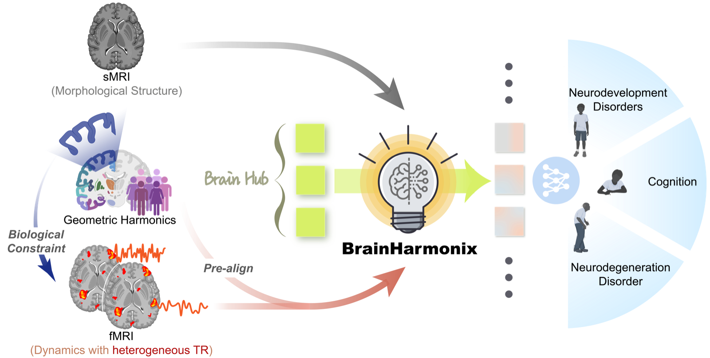

# BrainHarmonix 🧠✨

Official repository of the paper  
**Brain Harmony: A Multimodal Foundation Model Unifying Morphology and Function into 1D Tokens (*NeurIPS* 2025)** <a href="https://arxiv.org/abs/2509.24693"></a>
<a href="https://creativecommons.org/licenses/by-nc-sa/4.0/"></a>

## Overview

<p align="center">
  
</p>
<p align="center">Schematic overview of BrainHarmonix.</p>

## 🏗️ Project Architecture

```
BrainHarmonix/
├── modules/harmonizer/          # Core training modules
│   ├── stage0_embed/           # Stage 0: Embedding extraction
│   ├── stage1_pretrain/        # Stage 1: Self-supervised pretraining
│   ├── stage2_finetune/        # Stage 2: Downstream task finetuning
│   └── util/                   # Utility functions
├── libs/                       # Core library files
│   ├── flex_transformer.py    # Flexible transformer architecture
│   ├── flex_patch_embed.py    # Flexible patch embedding
│   ├── position_embedding.py  # Position encoding modules
│   └── masks/                 # Masking strategies
├── datasets/                   # Dataset processing
├── configs/                    # Configuration files
├── checkpoints/                # Pretrained model weights
│   ├── harmonix-f/            # fMRI pretrained models
│   ├── harmonix-s/            # T1 structural pretrained models
│   └── harmonizer/            # Joint pretrained models
├── scripts/                    # Training scripts
└── experiments/                # Training outputs
```

## 🚀 Quick Start

### Environment Setup

#### Conda Environment (Recommended)

```bash
# Create conda environment
conda create -n brainharmonix python=3.10
conda activate brainharmonix

pip install torch==2.6.0 torchvision==0.21.0 --index-url https://download.pytorch.org/whl/cu124

pip install packaging==25.0 ninja==1.11.1.4

pip install -r requirements.txt

pip install -e .
```

### Download Pretrained Checkpoints

<p align="center">
  <a href="https://drive.google.com/drive/folders/12MkUAOcegU60YVlK8u8_Owmgk4eQVheB?usp=sharing">
    
  </a>
</p>

Place the downloaded checkpoints in:

- `checkpoints/harmonix-f/` — fMRI pretrained models  
- `checkpoints/harmonix-s/` — T1 structural pretrained models  
- `checkpoints/harmonizer/` — Joint pretrained models

### Training Pipeline

#### Stage 0: Embedding Extraction

```bash
# Generate embeddings for pretraining
bash scripts/harmonizer/stage0_embed/run_embed_pretrain.sh configs/harmonizer/stage0_embed/conf_embed_pretrain.py
```

#### Stage 1: Self-supervised Pretraining

```bash
# Run pretraining with specified model size and latent tokens
bash scripts/harmonizer/stage1_pretrain/run_pretrain.sh base 128
```

#### Stage 2: Downstream Task Finetuning

```bash
# Finetune on downstream tasks (e.g., ABIDE dataset)
bash scripts/harmonizer/stage2_finetune/run_finetune.sh base 128 AbideI 0
```

## Citation

If you find this repository useful, please cite our *NeurIPS* 2025 paper:

```bibtex
@inproceedings{dong2025brain,
  title={Brain Harmony: A Multimodal Foundation Model Unifying Morphology and Function into 1D Tokens},
  author={Dong, Zijian and Li, Ruilin and Chong, Joanna Su Xian and Dehestani, Niousha and Teng, Yinghui and Lin, Yi and Li, Zhizhou and Zhang, Yichi and Xie, Yapei and Ooi, Leon Qi Rong and others},
  booktitle={Proceedings of the 39th Conference on Neural Information Processing Systems (NeurIPS)},
  year={2025}
}
```

---

*BrainHarmonix - Advancing Brain Imaging Analysis with AI* 🧠🤖
